# ML SERVICE - Diabetes Prediction

## Сборка проекта
Для воссоздания окружения с нужными зависимостями запустите команду из терминала в корне проекта

```bash
uv sync
```


Предварительно была зафиксирована версия Python (появится файл .python-version в корне проекта) через

```bash
uv python pin 3.11
```
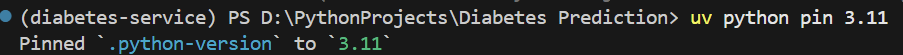

Предварительно стоит выйти и зайти вновь в терминал для автоматической активации окружения venv после `uv sync`. Проверим, что импорты корректно работают через команду

```bash
uv run python -c "import diabetes; print('ok')"
```
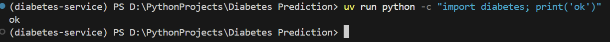

Запустим тесты проекта

```bash
uv run pytest
```

Запустим наше приложение на FastApi на порту 8000

```bash
uv run uvicorn diabetes.service.app:app --port 8000
```

В Doсkerfile у нас прописано 

```bash
uv run --no-sync uvicorn churn.service.app:app --host 0.0.0.0 --port 8000
```

`--host 0.0.0.0` - слушать все интерфейсы, обязательно нужно внутри контейнера

`diabetes.service.app:app` - путь до объекта: модуль двоеточие переменная

## Проверка работоспособности сервиса
Поскольку мы подняли наш мл сервис предсказания оттоков клиентов телеком компании, необходимо проверить его доступность через написанный API сервиса

Откроем терминал git bash

Доступность проверяется

```bash
curl localhost:8000/health
```

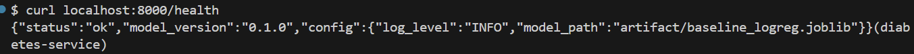

Для проверки работы сервиса передадим тестовый экземляр в формате json в тело POST запроса на endpoint localhost:8000/v1/predict к сервису и посмотрим на результат работы мл модели с сервисом

```bash
curl -X POST localhost:8000/v1/predict -H "Content‐Type: application/json" -d @good.json
```
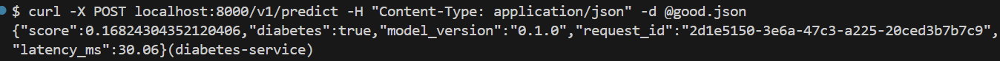


Также передадим экземляр, который не удовлетворяем схеме входных данных сервиса

```bash
curl -i -X POST localhost:8000/v1/predict -H "Content‐Type: application/json" -d "{\"age\": ‐1}"
```
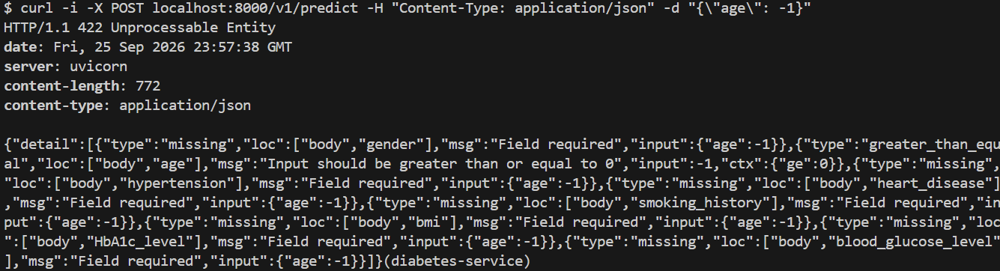

## Сборка и запуск контейнера с docker образом
В корне проекта имеется написанный Dockerfile для сборки docker-образа нашего приложения. Образ собирается командой

```bash
docker build -t diabetes-service:1.0 .
```
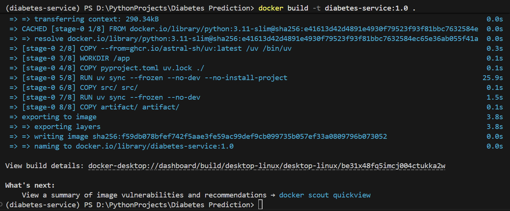

После сборки образа необходимо запустить контейнер с флагом `--rm`, который позволяет удалить контейнер после остановки

```bash
docker run --rm -p 8000:8000 diabetes-service:1.0
```

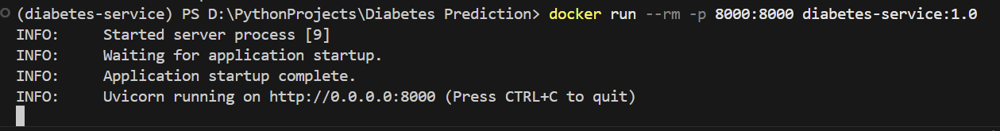

Порядок слоёв в Dockerfile необходимо держать следующим - сначала зависимости, потом код. В этом случае при изменении кода зависимости будут браться из кэша и повторная сборка образа пройдет значительно быстрее.

## Развертывание сервиса через Docker Compose
Поднимаем docker compose с нашим сервисом на FastApi и базой Postgres для логирования запросов модели с предсказаниями. Docker compose разворачивает компоненты services в виде контейнеров

```bash
docker compose up -d --build
```

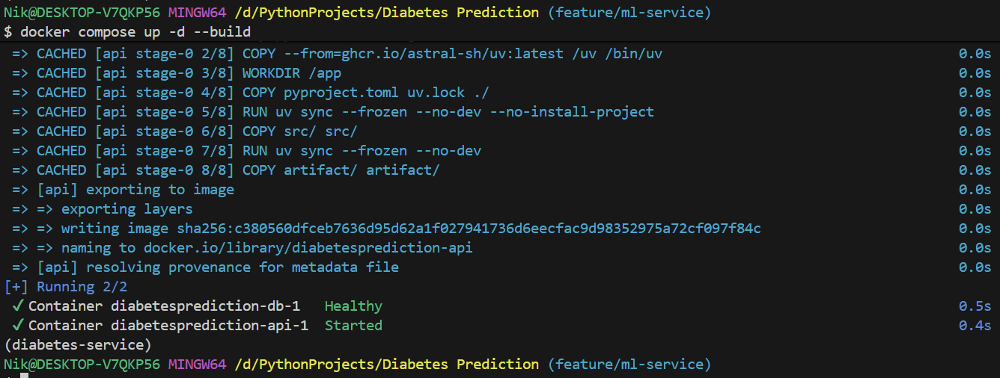

Проверяем наличие строк в базе (предварительно вновь сделаем запрос, но уже к поднятому контейнеру)

```bash
curl -X POST localhost:8000/v1/predict -H "Content‐Type: application/json" -d @good.json
```

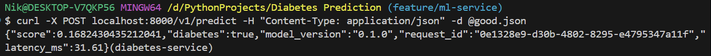

```bash
docker compose exec db psql -U postgres -d diabetes \
-c "SELECT request_id, score, latency_ms FROM predictions;"
```

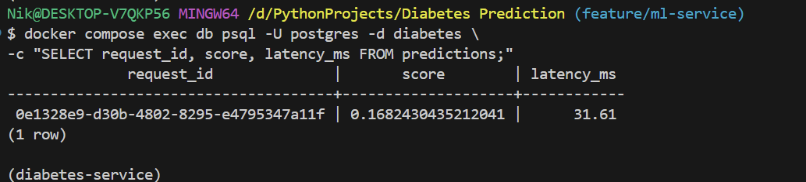


## Создание кластера kubernetes на kind

Создаём кластер с именем diabetes-service-cluster через kubernetes kind

```bash
kind create cluster --name diabetes-service-cluster
```
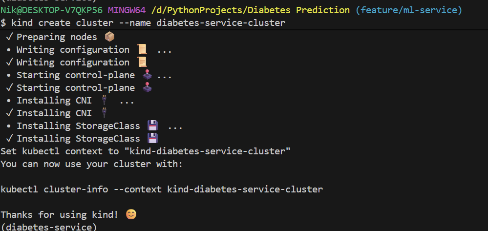

## Развертывание мл сервиса на узлах кластера kind

Загружаем докер-образ нашего мл сервиса на узлы кластера

```bash
kind load docker-image diabetes-service:1.0 --name diabetes-service-cluster
```
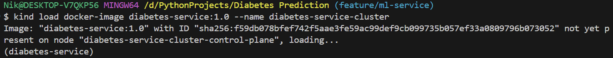

Если необходимо удалить кластер, то нужно вызвать команду

```bash
kind delete cluster --name diabetes-service-cluster
```

Далее необходимо применить написанные манифесты для kubernetes к нашему кластеру из папки k8s

```bash
kubectl apply -f k8s/
```
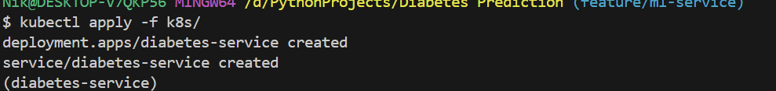

Для получения информации о подах кластера вызвать

```bash
kubectl get pods
```
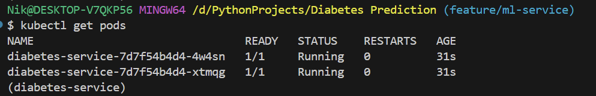

Дожидаемся конца выката

```bash
kubectl rollout status deploy/diabetes‐service
```

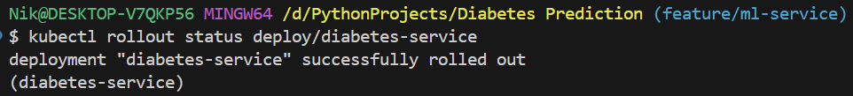

Создаем туннель с порта 8080 нашей машины до порта 80 сервиса нашего кластера

```bash
kubectl port‐forward svc/diabetes‐service 8080:80
```
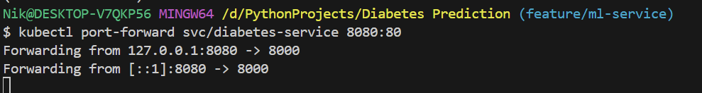

На пути запросов три порта: наш 8080, который идёт на 80 порт сервиса кластера и оттуда на 8000 порт контейнера

## Мониторинг кластера с подами сервиса
Для удобного мониторинга нашего кластера необходимо установить утилиту k9s

```bash
winget install Derailed.k9s
```

Вызов утилиты производится командой

```bash
k9s
```

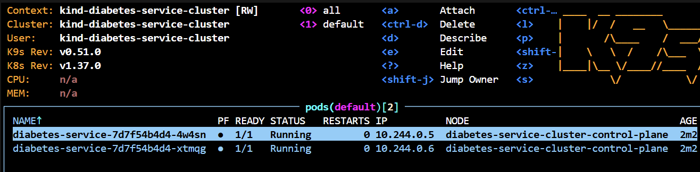

Делаем далее запрос и видим его в логах одного из подов через k9s

```bash
curl -X POST localhost:8080/v1/predict -H "Content‐Type: application/json" -d @good.json
```

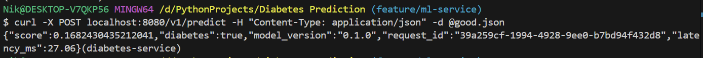

## Нагрузочное тестирование сервиса через locust
Далее проведём нагрузочное тестирование через locust. Запустим его командой с выводом в консоль, предварительно нужно поднять наш сервис на порту 8000 (можно через docker compose)

```bash
uv run locust -f locustfile.py --headless -u 10 -r 5 -t 60s --csv run10 -H http://127.0.0.1:8000
```


```bash
uv run locust -f locustfile.py --headless -u 50 -r 10 -t 60s --csv run50 -H http://127.0.0.1:8000
```

```bash
uv run locust -f locustfile.py --headless -u 100 -r 20 -t 60s --csv run100 -H http://127.0.0.1:8000
```

| Тест | Тип | Имя | Запросов | Ошибок | Медиана (мс) | Среднее (мс) | Мин (мс) | Макс (мс) | Ср. размер (Б) | Запросов/с | 50% | 75% | 90% | 95% | 98% | 99% | 99.9% | 100% |
| :--- | :--- | :--- | :--- | :--- | :--- | :--- | :--- | :--- | :--- | :--- | :--- | :--- | :--- | :--- | :--- | :--- | :--- | :--- |
| **Run 1** | POST | `/v1/predict` | 729 | 0 | 7 | 10.56 | 4.98 | 347.53 | 138.90 | 12.95 | 7 | 10 | 12 | 15 | 28 | 41 | 350 | 350 |
| **Run 2** | POST | `/v1/predict` | 3719 | 0 | 11 | 20.67 | 5.15 | 860.24 | 138.92 | 62.69 | 11 | 16 | 24 | 30 | 94 | 280 | 850 | 860 |
| **Run 3** | POST | `/v1/predict` | 7130 | 0 | 29 | 55.80 | 5.39 | 464.23 | 139.00 | 120.24 | 29 | 64 | 140 | 200 | 290 | 330 | 450 | 460 |

Команда запустила тест предсказаний мл сервиса. Тестируемый endpoint описан в locustfile


По итогам нагрузочных тетсирований Failure Count = 0 во всех трех запусках.


Базовая скорость (Run 1, ~13 RPS): Медиана 7 мс, P95 = 15 мс. Это очень быстрый отклик, характерный для хорошо оптимизированного инференса или кэшированных ответов.


Средняя нагрузка (Run 2, ~63 RPS): Медиана выросла незначительно (до 11 мс), P95 = 30 мс. 
Сервис чувствует себя комфортно, деградация минимальна.


Пиковая нагрузка (Run 3, ~120 RPS): Здесь начинается заметная деградация.

Медиана выросла до 29 мс (все еще хорошо).
Среднее время (55.8 мс) стало почти в 2 раза выше медианы (29 мс). Это классический признак появления "длинного хвоста" (long tail) задержек. Очередь запросов начинает расти. 
P95 скакнул до 200 мс

Аномалия - максимальное время отклика на средней нагрузке run2 вдвое больше, чем на пиковой run3 (860 мс против 464 мс). Возможно произошёл какой-то сбой

## Деплой обновленного сервиса на кластер
Далее осуществим выкат новой версии нашего сервера на кластер kubernetes. Поскольку мы прописали новый файл с нагрузочным тестированием, то можем собрать новый докер образ нашего сервиса. Сначала соберем новый докер образ c тегом 1.1 командой:

```bash
docker build -t diabetes‐service:1.1 .
```
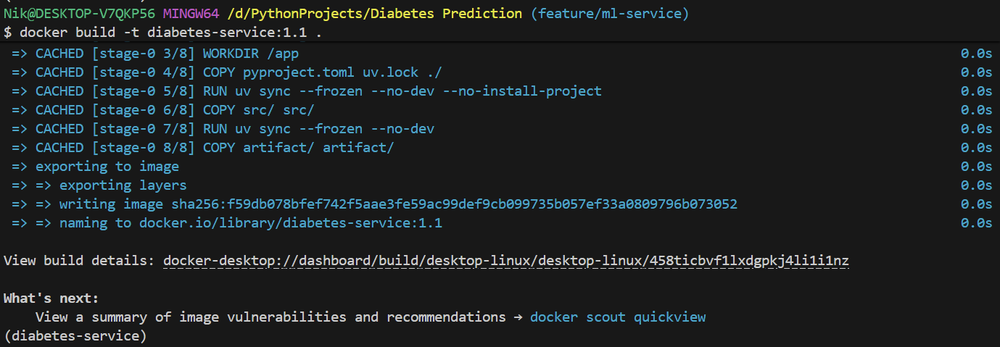

Далее загрузим образ в node кластера (это не раскатка, а лишь помещение нашего образа в кластер для последующей раскатки) командой

```bash
kind load docker-image diabetes-service:1.1 --name diabetes-service-cluster
```

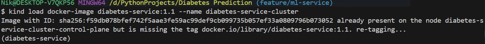

Осуществим постепенную выкатку на поды командой

```bash
kubectl set image deploy/diabetes-service api=diabetes-service:1.1
```
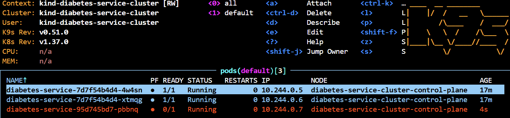

Видно, что началась раскатка новых подов

Дождемся конца выката

```bash
kubectl rollout status deployment/diabetes-service
```
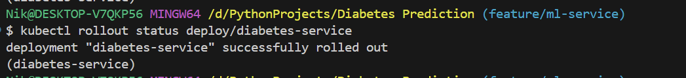

Посмотрим в логи подов на кластере

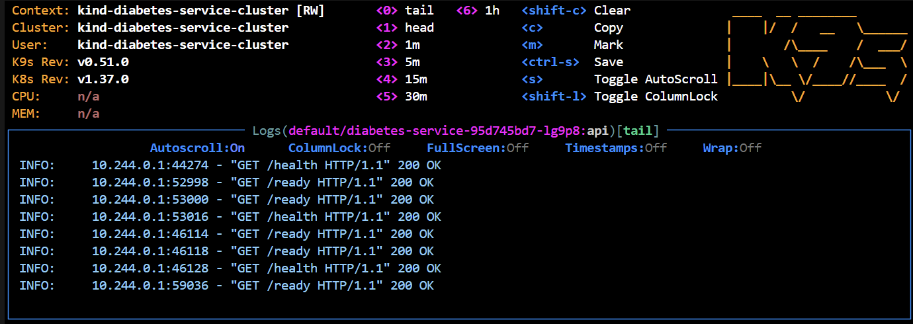

Также видно,что версия контейнера в подов поменялась на 1.1

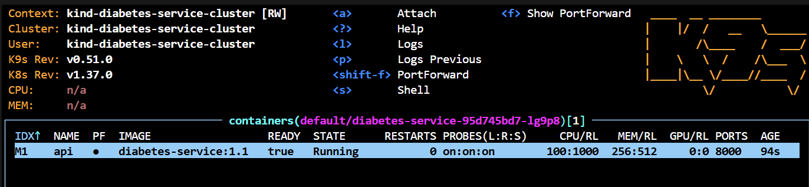

Выкатка прошла успешно. После выкатки нужно не забывать вновь поднять туннель через port-forward, если необходимо подключиться и проверить работу сервиса (так как прошлые поды после выкатки умерли)

## Откат обновления на кластере
Откатимся теперь на прошлую версию в кластере командой 

```bash
kubectl rollout undo deploy/diabetes-service
```

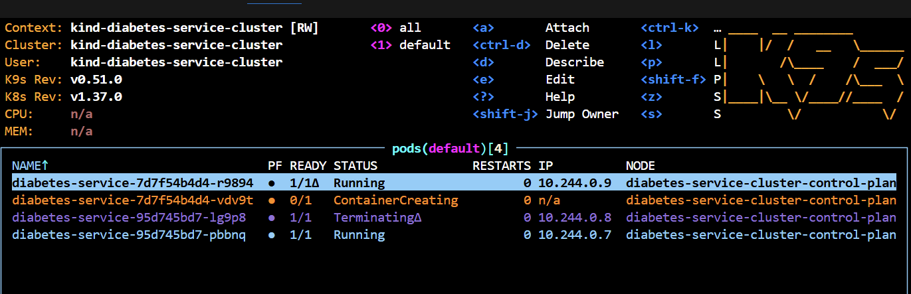

Пошел откат

Посмотрим в подах какая версия контейнера и видим, что вернулись на 1.0

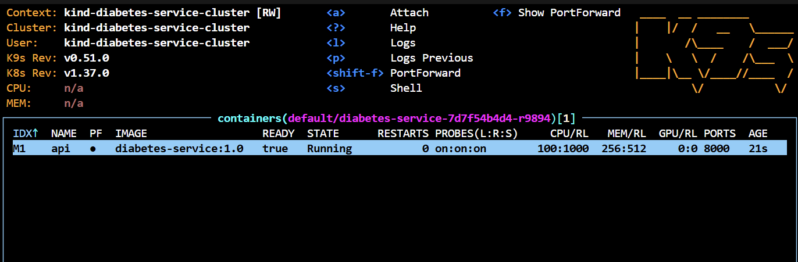

Выведем историю выкаток командой

```bash
kubectl rollout history deploy/diabetes-service
```
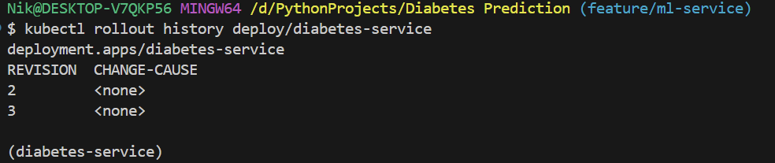


## Журнал проблем
Не загружался докер образ в кластер kind, оказалось неверно указал тэг при загрузке образа, исправил тэг и всё заработало.