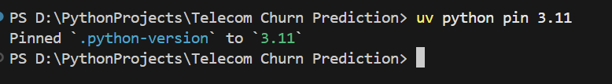
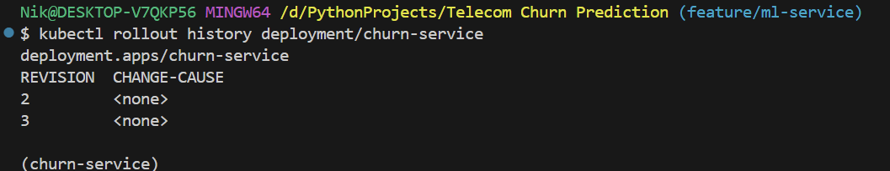

ML SERVICE - Churn Prediction

## Сборка проекта
Для воссоздания окружения с нужными зависимостями запустите команду из терминала в корне проекта

```bash
uv sync
```


Предварительно была зафиксирована версия Python (появится файл .python-version в корне проекта) через

```bash
uv python pin 3.11
```



Предварительно стоит выйти и зайти вновь в терминал для автоматической активации окружения venv после `uv sync`. Проверим, что импорты корректно работают через команду

```bash
uv run python -c "import churn; print('ok')"
```


Запустим тесты проекта

```bash
uv run pytest
```

Запустим наше приложение на FastApi на порту 8000

```bash
uv run uvicorn churn.service.app:app --port 8000
```

В Doсkerfile у нас прописано 

```bash
uv run --no-sync uvicorn churn.service.app:app --host 0.0.0.0 --port 8000
```

`--host 0.0.0.0` - слушать все интерфейсы, обязательно нужно внутри контейнера

`churn.service.app:app` - путь до объекта: модуль двоеточие переменная

## Проверка работоспособности сервиса
Поскольку мы подняли наш мл сервис предсказания оттоков клиентов телеком компании, необходимо проверить его доступность через написанный API сервиса

Откроем терминал git bash

Доступность проверяется

```bash
curl localhost:8000/health
```


Для проверки работы сервиса передадим тестовый экземляр в формате json в тело POST запроса на endpoint localhost:8000/v1/predict к сервису и посмотрим на результат работы мл модели с сервисом

```bash
curl -X POST localhost:8000/v1/predict -H "Content‐Type: application/json" -d @good.json
```


Также передадим экземляр, который не удовлетворяем схеме входных данных сервиса

```bash
curl -i -X POST localhost:8000/v1/predict -H "Content‐Type: application/json" -d "{\"tenure\": ‐1}"
```


## Сборка и запуск контейнера с docker образом
В корне проекта имеется написанный Dockerfile для сборки docker-образа нашего приложения. Образ собирается командой

```bash
docker build -t churn‐service:1.0 .
```


После сборки образа необходимо запустить контейнер с флагом `--rm`, который позволяет удалить контейнер после остановки

```bash
docker run --rm -p 8000:8000 churn‐service:1.0
```


Порядок слоёв в Dockerfile необходимо держать следующим - сначала зависимости, потом код. В этом случае при изменении кода зависимости будут браться из кэша и повторная сборка образа пройдет значительно быстрее.

## Развертывание сервиса через Docker Compose
Поднимаем docker compose с нашим сервисом на FastApi и базой Postgres для логирования запросов модели с предсказаниями. Docker compose разворачивает компоненты services в виде контейнеров

```bash
docker compose up -d --build
```


Проверяем наличие строк в базе (предварительно вновь сделаем запрос, но уже к поднятому контейнеру 

```bash
curl -X POST localhost:8000/v1/predict -H "Content‐Type: application/json" -d @good.jso )
```


```bash
docker compose exec db psql -U postgres -d churn \
-c "SELECT request_id, score, latency_ms FROM predictions;"
```


## Создание кластера kubernetes на kind

Создаём кластер с именем churn-service-cluster через kubernetes kind

```bash
kind create cluster --name churn-service-cluster
```


## Развертывание мл сервиса на узлах кластера kind

Загружаем докер-образ нашего мл сервиса на узлы кластера

```bash
kind load docker‐image churn‐service:1.0 --name churn-service-cluster
```


Если необходимо удалить кластер, то нужно вызвать команду

```bash
kind delete cluster --name churn-service-cluster
```

Далее необходимо применить написанные манифесты для kubernetes к нашему кластеру из папки k8s

```bash
kubectl apply -f k8s/
```


Для получения информации о подах кластера вызвать

```bash
kubectl get pods
```


Дожидаемся конца выката

```bash
kubectl rollout status deploy/churn‐service
```


Создаем туннель с порта 8080 нашей машины до порта 80 сервиса нашего кластера

```bash
kubectl port‐forward svc/churn‐service 8080:80
```


На пути запросов три порта: наш 8080, который идёт на 80 порт сервиса кластера и оттуда на 8000 порт контейнера

## Мониторинг кластера с подами сервиса
Для удобного мониторинга нашего кластера необходимо установить утилиту k9s

```bash
winget install Derailed.k9s
```

Вызов утилиты производится командой

```bash
k9s
```


Делаем далее запрос и видим его в логах одного из подов через k9s

```bash
curl -X POST localhost:8080/v1/predict -H "Content‐Type: application/json" -d @good.json
```


## Нагрузочное тестирование сервиса через locust
Далее проведём нагрузочное тестирование через locust. Запустим его командой с выводом в консоль, предварительно нужно поднять наш сервис на порту 8000 (можно через docker compose)

```bash
uv run locust -f locustfile.py --headless -u 100 -r 10 -t 30s -H http://127.0.0.1:8000
```

Команда запустила тест предсказаний мл сервиса с 100 пользователями, каждую секунду добавляются 10 новых пользователей, время теста 30 секунд. тестируемый endpoint описан в locustfile

По итогам нагрузочного тестирования сервис показал нагрузку в среднем 97 запросов в секунду, пиковая была в 121 запросов в секунду. Время отклика медианное (50 процентиль) 70 мс, 95 процентиль 200 мс. Видно, что на 98 и 99 процентили время отклика стало более 2 секунд (2100-2200 мс). Ошибок в ходе нагрузочного тестирования не 


## Деплой обновленного сервиса на кластер
Далее осуществим выкат новой версии нашего сервера на кластер kubernetes. Поскольку мы прописали новый файл с нагрузочным тестированием, то можем собрать новый докер образ нашего сервиса. Сначала соберем новый докер образ c тегом 1.1 командой:

```bash
docker build -t churn‐service:1.1 .
```


Далее загрузим образ в node кластера (это не раскатка, а лишь помещение нашего образа в кластер для последующей раскатки) командой

```bash
kind load docker-image churn-service:1.1 --name churn-service-cluster
```


Осуществим постепенную выкатку на поды командой

```bash
kubectl set image deployment/churn-service api=churn-service:1.1
```


Видно, что началась раскатка новых подов

Дождемся конца выката

```bash
kubectl rollout status deployment/churn-service
```


Посмотрим в логи подов на кластере


Также видно,что версия контейнера в подов поменялась на 1.1


Выкатка прошла успешно. После выкатки нужно не забывать вновь поднять туннель через port-forward, если необходимо подключиться и проверить работу сервиса (так как прошлые поды после выкатки умерли)

## Откат обновления на кластере
Откатимся теперь на прошлую версию в кластере командой 

```bash
kubectl rollout undo deployment/churn-service
```


Пошел откат

Посмотрим в подах какая версия контейнера и видим, что вернулись на 1.0


Выведем историю выкаток командой

```bash
kubectl rollout history deployment/churn-service
```
